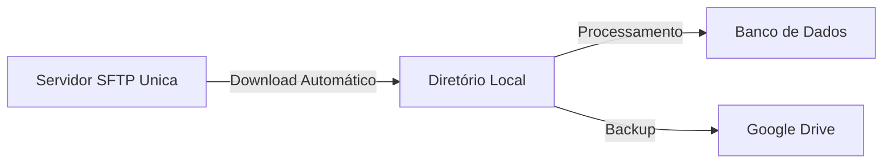

# MVP 03 - Engenharia de Dados - Pipeline de Análise MDR
- Edivaldo Bezerra Alves Júnior
- PUC RJ

## Objetivo do Projeto
Este MVP tem como objetivo construir um pipeline de dados completo para análise e otimização de taxas MDR (Merchant Discount Rate) em transações financeiras. O projeto resolve um problema real de negócio: a necessidade de analisar e otimizar custos de taxas MDR através de um processo automatizado de coleta, processamento e análise de dados.

### Perguntas de Negócio
1. Qual o impacto financeiro atual das taxas MDR por produto?
2. Como as taxas MDR variam por tipo de produto e forma de pagamento?
3. Qual seria o impacto financeiro de diferentes cenários de negociação de taxas?


### Solução Implementada
- Pipeline ETL automatizado com integração SFTP
- Modelo dimensional com Star Schema
- Ferramentas de simulação de cenários

## Documentação do ETL - Unica Transactions

Este documento descreve o processo de ETL (Extract, Transform, Load) implementado para processar extratos financeiros da Unica. O sistema é responsável por extrair dados de arquivos de extrato via SFTP, transformá-los em um formato adequado e carregá-los em um banco de dados dimensional para análise. Após o processamento, os arquivos são armazenados com backup no Google Drive para histórico e auditoria.

## Arquitetura do Sistema

### Componentes Principais
1. **Extrator de Arquivos**
   - Conexão e download de arquivos via SFTP do servidor Unica
   - Monitoramento automático de novos arquivos no servidor SFTP
   - Validação de formato e estrutura dos arquivos baixados
   - Integração com Google Drive para backup após processamento

2. **Processador de Dados**
   - Leitura e parsing de arquivos de extrato
   - Transformação e validação de dados
   - Preparação de tabelas dimensionais e fatos
   - Registro de status de processamento para cada arquivo

3. **Banco de Dados**
   - Schema: `unica_transactions`
   - Modelo dimensional com tabelas de fato e dimensões
   - Controle de processamento de arquivos

### Fluxo de Integração

### Estrutura de Diretórios
```
├── data/
│   └── EXTRATO_UNICA_51309_20240917...  # Arquivos de extrato
├── docs/
│   ├── catalogo_dados.md                # Catálogo de dados
│   └── modelo_dados.dbml                # Modelo DBML
├── notebooks/
   └── tryout.ipynb                       # Notebook para tryout do arquivo teste e apresentação das analises
├── outputs/
   └── log                               # Diretório para armazenar os logs 
├── scripts/
│   ├── connection_db.py               # Configuração de conexão e querys
│   ├── create_database.sql            # Schema do banco (funções SQL para configuração do banco)
│   ├── leitor_extratos.py             # Módulo principal de processamento que coordena a leitura, validação e transformação dos arquivos de extrato
│   ├── reading_files.py               # Leitura de arquivos no padrão recebido no SFTP
│   └── transform_files.py             # Transformação de dados
├── main.py                           # Script principal que orquestra todo o fluxo de ETL, excutado via cron diariamente às 02:00
└── README.md                    
```

## Fluxo de Processamento

### 1. Extração (reading_files.py)
- Download automático de arquivos via SFTP do servidor Unica
- Validação do formato do arquivo (nome deve seguir padrão: EXTRATO_UNICA_[ID]_[DATA]_[SEQ])
- Backup automático para Google Drive após processamento bem-sucedido
- Registro de cada arquivo no controle de processamento (`controle_arquivos`)

### 2. Transformação (transform_files.py, leitor_extratos.py)
- Parsing do arquivo de extrato com validação de estrutura (com base na documentação enviada pela Única)
- Preparação das dimensões com deduplicação:
  - `loja`: Identificação e dados do estabelecimento
  - `produto`: Categorização (Crédito/Débito, Visa/Master/Elo)
  - `pagamento`: Modalidade (à vista/parcelado) e condições
  - `tempo`: Datas de transação e processamento

### 3. Carregamento (leitor_extratos.py)
- Inserção em lote com controle transacional
- Atualização atômica (commit apenas após sucesso completo)
- Rollback automático em caso de falha

## Componentes Detalhados

### 1. Pipeline Principal (main.py)
Orquestra o processo ETL completo:
```python
# Exemplo de uso
python main.py --input-dir /path/to/extracts --backup-dir /path/to/backup
```

### 2. Leitor de Extratos (leitor_extratos.py)
Núcleo do processamento de arquivos:

**Funções Principais:**
- `process_file(filepath, conn)`: Coordena o processamento com controle transacional
- `prepare_dimension_tables(data, conn)`: Insere/atualiza dimensões
- `register_file_processing(filename, status, conn)`: Controle de processamento

### 3. Análise de MDR (analysis.py)
Ferramenta para análise de taxas:

**Funções Principais:**
- `calculate_mdr_by_produto(connection_params, mes=None)`: 
  - Calcula MDR atual por produto
  - Agrupa por NSU único
  - Permite filtro mensal
  
- `simulate_mdr_by_product(connection_params, taxas_json)`:
  - Simula impacto de novas taxas
  - Comparação visual MDR atual vs proposto
  
- `plot_mdr_by_produto(df)`:
  - Visualização de MDR percentual
  - Gráficos comparativos


### 4. Modelo de Dados
Schema `unica_transactions`:

**Tabela Fato:**
```sql
CREATE TABLE transacoes (
    nsu_host_transacao VARCHAR PRIMARY KEY,
    valor_bruto_venda DECIMAL(15,2),
    valor_liquido_venda DECIMAL(15,2),
    -- outros campos
);
```

**Tabelas de Dimensão:**
- `loja`: Informações das lojas
- `produto`: Tipos de produtos
- `pagamento`: Formas de pagamento
- `tempo`: Dimensão temporal
- `controle_arquivos`: Controle de processamento

## Tratamento de Erros

### 1. Validação de Arquivos
- Verificação de formato e estrutura
- Validação de campos obrigatórios
- Verificação de consistência de dados

### 2. Tratamento de Exceções
- Log detalhado de erros, por execução.
- Rollback de transações em caso de falha
- Registro de erros no controle de arquivos

## Notebook de teste e apresentação da análise

### Tryout Notebook (tryout.ipynb)
Notebook para teste e validação do pipeline ETL e visualização das análises de MDR. Permitindo:

- Testar diferentes cenários de taxas MDR
- Visualizar as análises realizadas durante o trabalho
- Testar o processamento do arquivo teste que está no diretório `data`

Acesso: 

- [Notebook de Teste](notebooks/tryout.ipynb)
- [Testar Notebook no Google Colab](https://colab.research.google.com/github/edi414/mvp_03_postgratudation/blob/main/notebooks/tryout.ipynb#scrollTo=-yo8smdoOHeg) 

## Referências

### Documentação
- [Catálogo de Dados](docs/catalogo_dados.md) - Descrição detalhada das tabelas e campos
- [Modelo de Dados](docs/modelo_dados.dbml) - Modelo dimensional (Star Schema)
- [Scripts SQL](scripts/create_database.sql) - DDL do banco de dados

## Stack Tecnológica
- **Armazenamento**: PostgreSQL (Data Warehouse)
- **ETL**: Python (pandas, psycopg2)
- **Análise**: Jupyter Notebooks, Matplotlib
- **Integração**: SFTP, Google Drive
- **Versionamento**: Git
